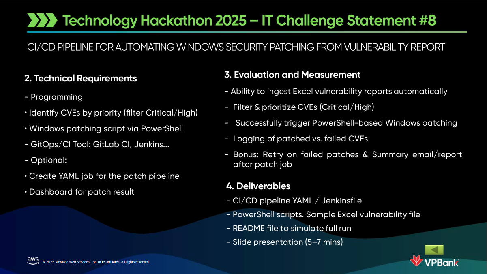
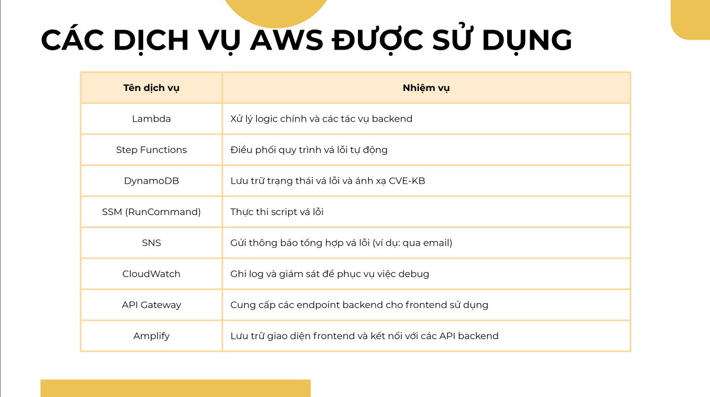

<h1 align="center">🔧 AutoPatch - VPBank Hackathon 2025</h1>

<h3>🥊 Thử thách của nhóm</h3>
<p align="center">
  
</p>

<p align="left">
  <em>Repo này là toàn bộ sản phẩm (prototype) nộp cho bản tổ chức, được cả nhóm thực hiện trong vòng 1 tháng (lên ý tưởng, thiết kế, triển khai và thử nghiệm). Đây là lần đầu tiên mình tham gia một cuộc thi hackathon, tuy không có giải nhưng mình vẫn rất vui vì được kết nối với 2 bạn Hà Nội trong team và có thêm kiến thức liên quan đến các dịch vụ của AWS. 

  Vai trò của mình trong nhóm là leader - thiết kế kiến trúc tổng thể của hệ thống và hiện thực hóa phần backend trên AWS (Lambda, Step Functions, SSM...).
  </em><br>
</p>

---

## 🧠 Chia sẻ cá nhân

- ✅ **Mức độ hoàn thành**: Dự án đã hoàn thành đúng với mục tiêu đề ra: hỗ trợ kiểm tra, đối chiếu và tự động vá lỗ hổng bảo mật trên các server Windows thông qua thông tin từ Microsoft MSRC và hệ thống EC2 của doanh nghiệp. Giao diện hiển thị tình trạng KB rõ ràng, cho phép chạy vá theo từng bản vá hoặc tất cả, có kết hợp giám sát tiến trình realtime. Tuy vẫn còn một vài điểm có thể cải thiện như tối ưu UI/UX và nâng cao kiểm soát phân quyền, hệ thống hiện tại đã đủ điều kiện để áp dụng nội bộ.

- 🧩 **Kinh nghiệm tích lũy**:
  - Làm quen với quy trình phát triển hệ thống phân tán, kết nối nhiều dịch vụ AWS. 
  - Thiết kế luồng tự động (automation flow) với Step Functions: triển khai luồng kiểm tra và vá KB theo từng bước nhỏ (fetch KB, so sánh, vá, ghi nhận trạng thái...).
  - Kết hợp các dịch vụ AWS như Lambda, DynamoDB, API Gateway, CloudWatch, và Systems Manager một cách liền mạch.
  - Làm việc với JSONPath, cấu trúc event-driven, và đồng bộ luồng dữ liệu giữa nhiều lambda function.
  - Triển khai cơ chế cập nhật trạng thái realtime cho từng instance thông qua cơ chế polling từ frontend.

- 📘 **Kiến thức học được**:
  - Xử lý dữ liệu bảo mật từ MSRC API và phân tích CVE severity theo logic nghiệp vụ.
  - Cách sử dụng Step Functions để điều phối logic phức tạp thay vì dùng nhiều hàm lồng nhau.
  - Lập trình Lambda bằng Python và xử lý logic không trạng thái.
  - Cách sử dụng Systems Manager RunCommand để tương tác với EC2 Windows và thu thập kết quả.
  - Áp dụng TTL vào DynamoDB để tự động xoá bản ghi tạm (giảm chi phí và tránh dữ liệu cũ).
  - Lần đầu tiên làm việc với AWS: hiểu về IAM, quyền truy cập tài nguyên, các giới hạn dịch vụ, cách phân tách môi trường phát triển và sản xuất.
  - Tổ chức project chuẩn hóa: tách module rõ ràng (fetch, patch, compare), phân chia frontend/backend hợp lý, và viết README có hướng dẫn đầy đủ.

> Sự thật thú vị: Vì là lần đầu tiên mình sử dụng AWS nên ban đầu gặp khá nhiều khó khăn như hiểu permission của IAM, cách connect API Gateway với Lambda hay format đúng input cho Step Function. Tuy nhiên sau khi làm quen, mình cảm thấy rất hứng thú với cách AWS hỗ trợ xây dựng hệ thống mở rộng, không cần quản lý server mà vẫn đảm bảo bảo mật và hiệu suất.

---

## 📌 Giới thiệu dự án

**AutoPatch** là hệ thống tự động giúp kiểm tra, phân tích và cập nhật các bản vá bảo mật cho hệ điều hành **Windows Server** trên môi trường AWS.

Toàn bộ quy trình được triển khai theo kiến trúc **serverless**, sử dụng **API Gateway** kết nối với các hàm **AWS Lambda**, giúp đảm bảo hiệu năng cao, dễ bảo trì và tiết kiệm chi phí vận hành.

### 🔁 Quy trình tổng thể:
1. **Fetch dữ liệu CVE mới nhất** từ Microsoft MSRC API.
2. **Lọc dữ liệu CVE** theo sản phẩm liên quan (Windows Server Core), mức độ nghiêm trọng (High/Critical), và định dạng lại thông tin (ID, KB, CVSS...).
3. **Lưu trữ CVE đã xử lý** vào DynamoDB để làm nguồn tham chiếu so sánh.
4. **Lấy danh sách EC2 instances**, gọi **AWS SSM RunCommand** để kiểm tra các KB đã cài và khả dụng.
5. **So sánh và xác định các KB thiếu** (chưa được cài đặt).
6. Cho phép:
   - Chạy vá tất cả KB còn thiếu cho toàn bộ server.
   - Chạy vá tất cả KB còn thiếu cho một server.
7. **Hiển thị kết quả lên giao diện người dùng**, bao gồm phần trăm đã vá và chi tiết theo từng server.
8. **Gửi kết quả patch qua email (SNS).**

### 🧩 Các dịch vụ AWS chính sử dụng:
<p align="center">
  
</p>

---

## 📄 Tài liệu trình bày

📥 [Xem slides trình bày sản phẩm tại đây](./slides.pdf)

---

## 📁 Cấu trúc thư mục
```
autopatch-vpbank-hackathon/
├── autopatch-frontend/  # Giao diện người dùng (React + Vite)
├── autopatch-backend/   # Chủ yếu là các hàm Lambda, và cách setup các dịch vụ khác liên quan
├── README.md            # File này
├── picture/             # Thư mục ảnh liên quan
└── slides.pdf           # Giao diện sản phẩm và luồng dịch vụ hoạt động bên dưới
