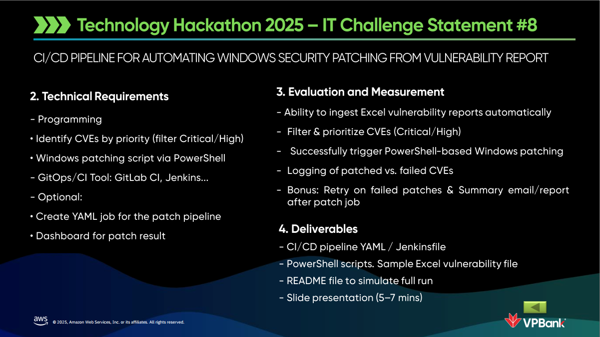

<h1 align="center">🔧 AutoPatch - VPBank Hackathon 2025</h1>

<h3>📜 Participation Certificate</h3>
<p align="center">
  
</p>

<h3>🥊 Team Challenge</h3>
<p align="center">
  
</p>

<p align="left">
  <em>This repo is the full product (prototype) submitted to the organizers, built by the entire team over the course of one month (ideation, design, implementation, and testing). This was my first hackathon — we didn't win any prize, but I'm really glad I got to connect with two teammates from Hanoi and deepen my knowledge of AWS services.

  My role in the team was team leader — I designed the overall system architecture and implemented the backend on AWS (Lambda, Step Functions, SSM...).
  </em><br>
</p>

---

## 🧠 Personal Reflections

- ✅ **Completion level**: The project fully met its intended goals: supporting the inspection, comparison, and automated patching of security vulnerabilities on Windows servers using data from Microsoft MSRC and the company's EC2 infrastructure. The UI clearly displays KB status, supports patching by individual patch or all at once, and includes real-time progress monitoring. While there is still room for improvement in UI/UX and access control, the current system is ready for internal deployment.

- 🧩 **Experience gained**:
  - Gained hands-on experience with distributed system development, connecting multiple AWS services.
  - Designed automation flows with Step Functions: implementing step-by-step KB check and patch flows (fetch KB, compare, patch, record status...).
  - Seamlessly integrated AWS services including Lambda, DynamoDB, API Gateway, CloudWatch, and Systems Manager.
  - Worked with JSONPath, event-driven architecture, and data flow synchronization across multiple Lambda functions.
  - Implemented real-time status updates per instance via frontend polling.

- 📘 **Knowledge acquired**:
  - Processing security data from the MSRC API and analyzing CVE severity according to business logic.
  - Using Step Functions to orchestrate complex logic instead of deeply nested functions.
  - Writing Lambda functions in Python with stateless logic.
  - Using Systems Manager RunCommand to interact with Windows EC2 instances and collect results.
  - Applying TTL in DynamoDB to automatically delete temporary records (reducing cost and avoiding stale data).
  - First-time experience with AWS: understanding IAM, resource access permissions, service limits, and separating development from production environments.
  - Structuring a project properly: clean module separation (fetch, patch, compare), a clear frontend/backend split, and writing a complete README with full documentation.

---

## 📌 Project Overview

**AutoPatch** is an automated system for inspecting, analyzing, and applying security patches to **Windows Server** operating systems in an AWS environment.

The entire workflow is deployed using a **serverless** architecture, with **API Gateway** connecting to **AWS Lambda** functions — ensuring high performance, easy maintenance, and low operational cost.

### 🔁 Overall Workflow:
1. **Fetch the latest CVE data** from the Microsoft MSRC API.
2. **Filter CVE data** by relevant product (Windows Server Core), severity level (High/Critical), and reformat the information (ID, KB, CVSS...).
3. **Store processed CVEs** in DynamoDB as a reference source for comparison.
4. **Retrieve the list of EC2 instances**, call **AWS SSM RunCommand** to check installed and available KBs.
5. **Compare and identify missing KBs** (not yet installed).
6. Allow:
   - Patching all missing KBs across all servers.
   - Patching all missing KBs for a single server.
7. **Display results on the user interface**, including patch percentage and per-server details.
8. **Send patch results via email (SNS).**


### 🧩 Main AWS Services Used:

| Service | Purpose |
|---|---|
| **Lambda** | Handles core logic and backend tasks |
| **Step Functions** | Orchestrates the automated patching workflow |
| **DynamoDB** | Stores patch status and CVE-KB mappings |
| **SSM (RunCommand)** | Executes patch scripts on EC2 instances |
| **SNS** | Sends patch summary notifications (e.g., via email) |
| **CloudWatch** | Logs and monitors for debugging purposes |
| **API Gateway** | Exposes backend endpoints for the frontend |
| **Amplify** | Hosts the frontend UI and connects it to backend APIs |

---

## 📄 Presentation Slides

📥 [View the product presentation slides here](./slides.pdf)

---

## 📁 Directory Structure
```
autopatch-vpbank-hackathon/
├── autopatch-frontend/  # User interface (React + Vite)
├── autopatch-backend/   # Mainly Lambda functions and setup for related services
├── README.md            # This file
├── picture/             # Related images directory
└── slides.pdf           # Product UI and underlying service flow
```
